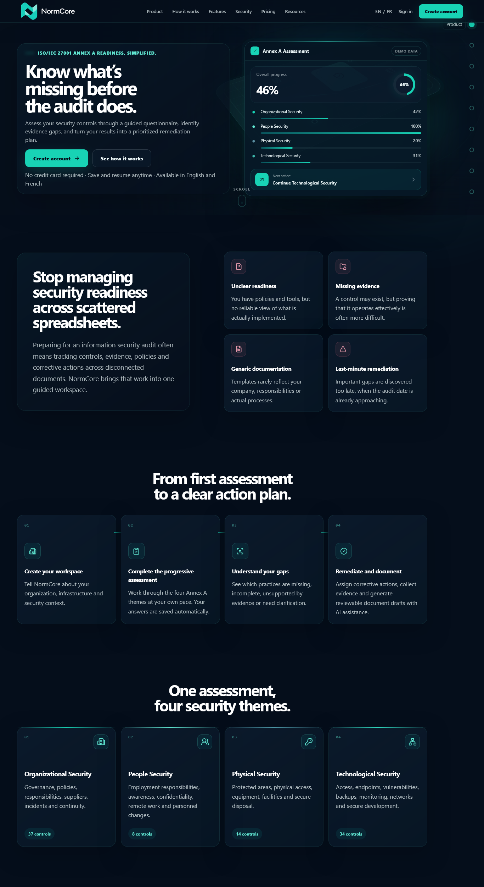
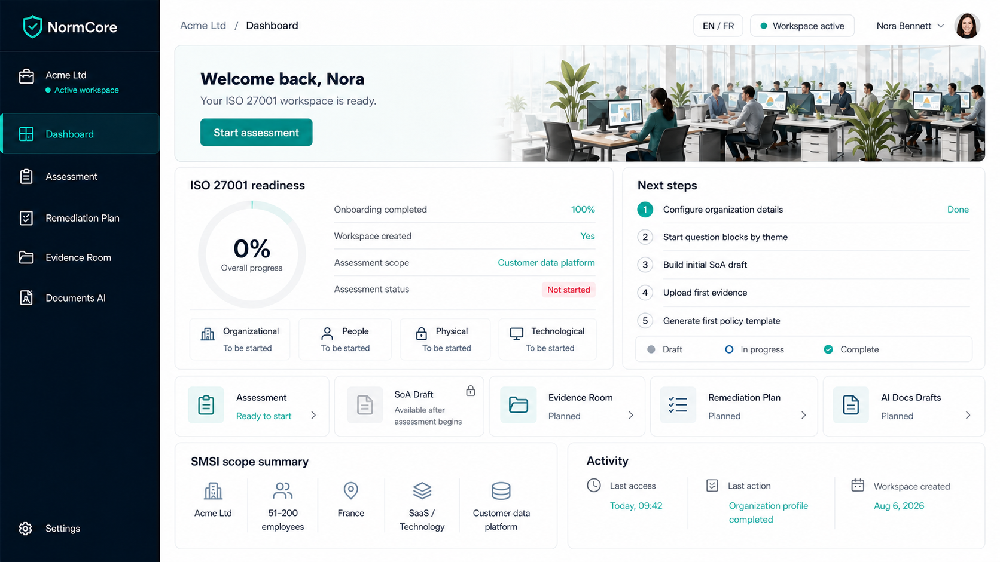
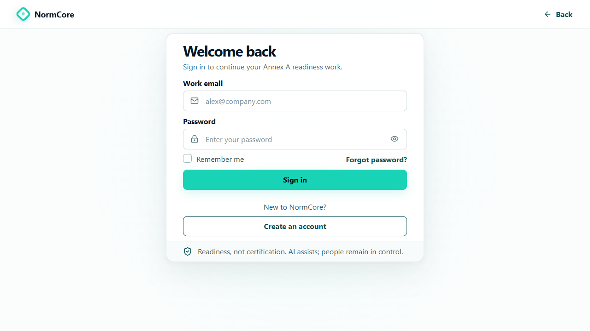
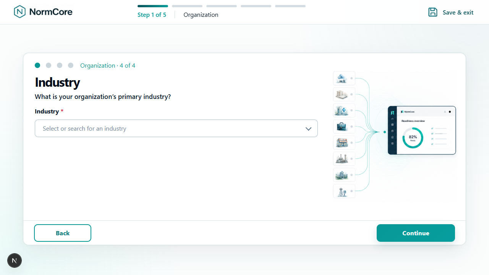
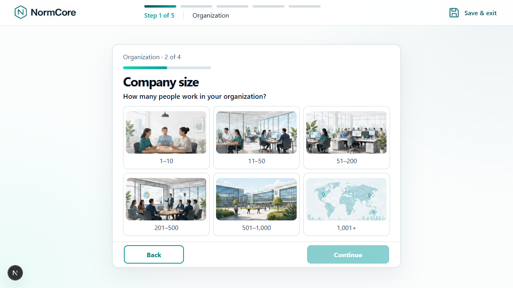
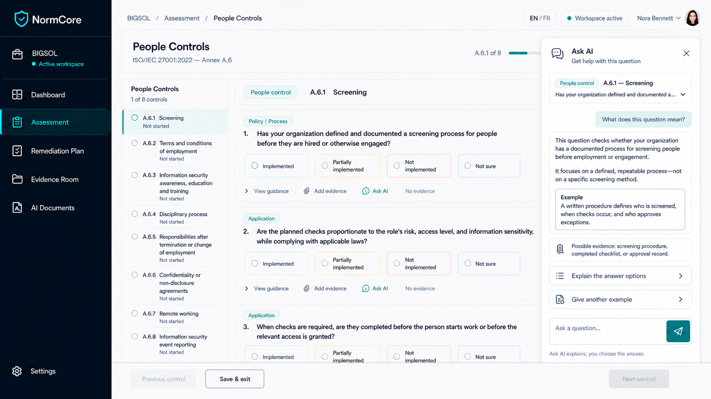
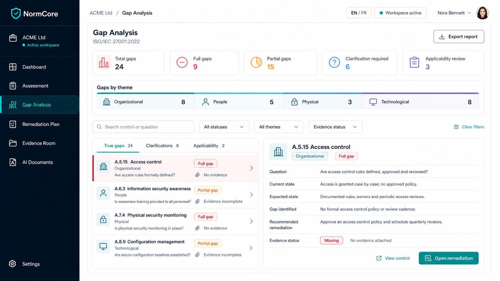
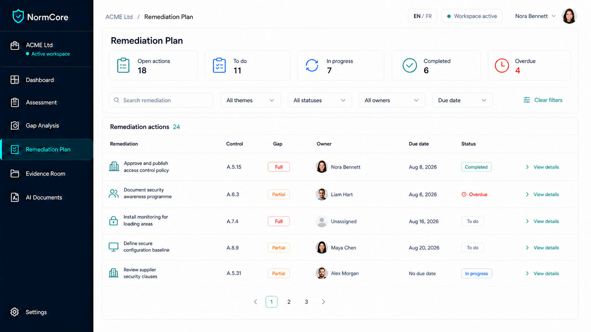
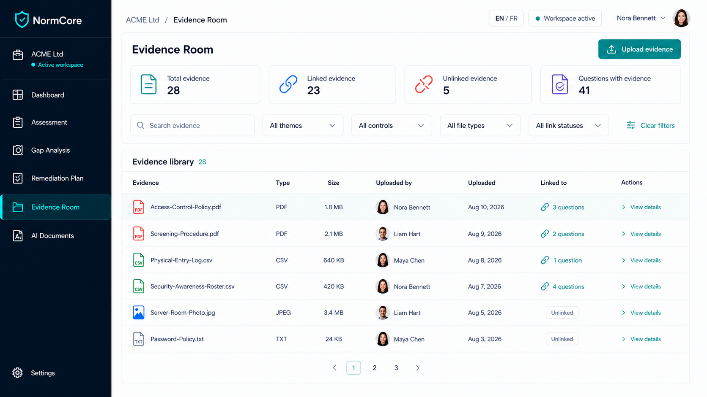
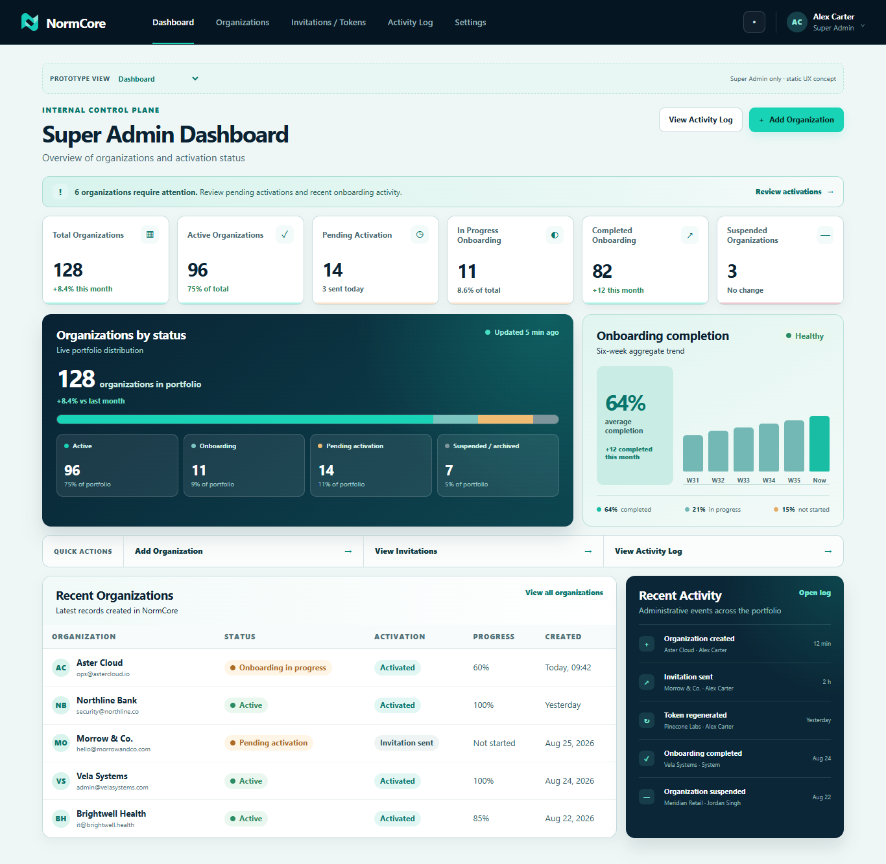

# NormCore

<p align="center">
  
</p>

## 1. What is NormCore?
NormCore (formerly known as CapISO) is a comprehensive web platform designed to facilitate ISO 27001 pre-audits. It provides organizations with a guided pathway to assess their security posture, identify gaps, plan remediations, and automatically generate required compliance documentation.

## 2. Main Features
- **Dynamic Assessments**: Interactive questionnaires covering ISO 27001 Annex A controls (Organizational, People, Physical, Technological).
- **Gap Analysis**: Automated comparison of assessment answers against ISO standard requirements.
- **Remediation Planning**: Track progress, assign responsibilities, and set deadlines for identified gaps.
- **Evidence Room**: A centralized repository to upload and link proofs of compliance directly to controls.
- **AI Document Generation**: Automated drafting of mandatory ISO 27001 policies using organizational context.
- **Super Admin Dashboard**: Centralized management of organizations, access requests, and platform activity.

<p align="center">
  
</p>

## 3. Technology Stack
- **Framework**: Next.js 15 (App Router)
- **Language**: TypeScript
- **Styling**: Tailwind CSS and CSS Modules
- **Database & Backend**: Supabase (PostgreSQL)
- **AI Integration**: Gemini, OpenAI, Groq, OpenRouter

## 4. Project Architecture
The project follows a modular, domain-driven design pattern built upon the Next.js App Router.
- `app/`: Routing, page components, and API endpoints.
- `components/`: Reusable React components organized by feature domain.
- `lib/`: Core business logic, Supabase clients, and AI provider integrations.
- `supabase/`: Database migrations, schema definitions, and RLS policies.
See [Architecture Documentation](docs/ARCHITECTURE.md) for more details.

## 5. Prerequisites
- **Node.js**: Installed locally (see version below).
- **Git**: For version control and cloning.
- **Supabase**: A Supabase project (either local via CLI or cloud-hosted).
- **AI API Keys**: At least one valid API key from a supported provider (e.g., Google Gemini).

## 6. Supported Node.js Version
NormCore requires **Node.js v18.18.0 or higher**.

## 7. Local Installation
Clone the repository and install dependencies:
```bash
git clone <repository-url> ISO-27001-Pre-Audit-Platform
cd ISO-27001-Pre-Audit-Platform
npm install
```

## 8. Environment Variables
Copy the provided `.env.example` file to create your local configuration:
```bash
cp .env.example .env.local
```
Update `.env.local` with your specific values. **Never commit `.env.local` to version control.** It contains sensitive API keys and configuration specific to your environment.

## 9. Supabase Configuration
NormCore relies heavily on Supabase for Authentication, Database, and Row Level Security (RLS). You must configure the following variables in `.env.local`:
- `NEXT_PUBLIC_SUPABASE_URL`
- `NEXT_PUBLIC_SUPABASE_PUBLISHABLE_KEY`
- `NEXT_PUBLIC_SUPABASE_ANON_KEY`
- `SUPABASE_SERVICE_ROLE_KEY` (Used securely on the server-side only).

## 10. Database Migrations
All database structures and RLS policies are stored in `supabase/migrations/`. 
To apply these to your local or production database, use the Supabase CLI:
```bash
npx supabase db push --db-url <your-db-url>
```
*Do not manually modify the database schema via the dashboard.*

## 11. Gemini / AI Configuration
To enable the AI Document Generation features, you must provide an API key. For the primary provider (Gemini):
- Obtain an API key from Google AI Studio.
- Set `GEMINI_API_KEY=your_api_key_here` in `.env.local`.
Other providers (OpenAI, Groq, OpenRouter) can be configured similarly.

## 12. Authentication Setup
Authentication is managed via Supabase Auth with Server-Side Rendering (SSR) support.
- Session tokens are stored in HTTP-only cookies.
- Ensure your local hostname (e.g., `http://127.0.0.1:3103`) is added to your Supabase project's allowed redirect URIs.

<p align="center">
  
</p>

## 13. Running the Application Locally
Start the development server:
```bash
npm run dev
```
The application will be accessible at the URL defined by `NEXT_PUBLIC_APP_URL` in your `.env.local` (default: `http://127.0.0.1:3103`).

## 14. Running Typecheck, Lint and Build
To validate the codebase integrity, run the following commands:
```bash
# Verify TypeScript typings
npm run typecheck

# Run ESLint static analysis
npm run lint

# Create a production build (verifies all Next.js static and dynamic routes)
npm run build
```

## 15. Running Tests / Playwright
NormCore includes integration and UI tests in the `scripts/` directory.
- Test scripts can be executed via Node (e.g., `node scripts/assessment-rls-integration-test.mjs`).
- If Playwright tests are configured, ensure browsers are installed: `npx playwright install`.

## 16. Production Build and Deployment
NormCore is optimized for deployment on Vercel or any standard Node.js hosting environment.
```bash
npm install --production
npm run build
npm start
```
Remember to apply your Supabase database migrations to your production instance before starting the server.

## 17. Main User Workflows
1. **Onboarding**: Users define their organization's scope and context.
   <br>
   <p align="center">
     
     
   </p>
2. **Assessment**: Users answer guided ISO 27001 questions.
   <br>
   <p align="center">
     
   </p>
3. **Gap Analysis**: The system calculates compliance gaps automatically.
   <br>
   <p align="center">
     
   </p>
4. **Remediation**: Users plan and assign tasks to fix gaps.
   <br>
   <p align="center">
     
   </p>
5. **Evidence Room**: Users upload proofs of compliance.
   <br>
   <p align="center">
     
   </p>
6. **AI Documents**: Users generate compliant security policies based on their unique context.
   <br>
   <p align="center">
     
   </p>

## 18. Super Admin Workflows
The Super Admin dashboard (`/super-admin`) is strictly isolated and allows administrators to:
- Review and approve/reject user access requests.
- Provision new organizations and workspaces.
- Monitor global platform activity and AI token usage.

<p align="center">
  
</p>

## 19. Security Considerations
- **Data Isolation**: Multi-tenancy is strictly enforced at the database level using PostgreSQL Row Level Security (RLS) policies. Users can only access data tied to their specific `workspace_id`.
- **Secret Management**: Never hardcode API keys or the `SUPABASE_SERVICE_ROLE_KEY`. They must remain in server-side environment variables.
- **Authentication**: Rely entirely on the Supabase SSR cookie implementation provided in `lib/supabase/`.

## 20. Troubleshooting
- **Build Errors**: Ensure you are running Node.js v18.18.0 or higher.
- **Authentication Failures**: Verify your Supabase URL, Anon Key, and redirect URIs in both `.env.local` and the Supabase dashboard.
- **Database Access Issues**: Verify that your `SUPABASE_SERVICE_ROLE_KEY` is correct, and that migrations have been successfully applied.

## 21. Detailed Documentation Links
For deep dives into specific subsystems, consult the `docs/` directory:
- [Architecture](docs/ARCHITECTURE.md)
- [Database & Migrations](docs/DATABASE.md)
- [Authentication](docs/AUTHENTICATION.md)
- [Security & Roles](docs/SECURITY.md)
- [Workflows](docs/WORKFLOW.md)
- [AI Capabilities](docs/AI.md)
- [Deployment](docs/DEPLOYMENT.md)
- [Project Overview](docs/PROJECT_OVERVIEW.md)
- [Frontend Guardrails](docs/README-NORMCORE-ASSESSMENT-FRONTEND-GUARDRAILS.md)
